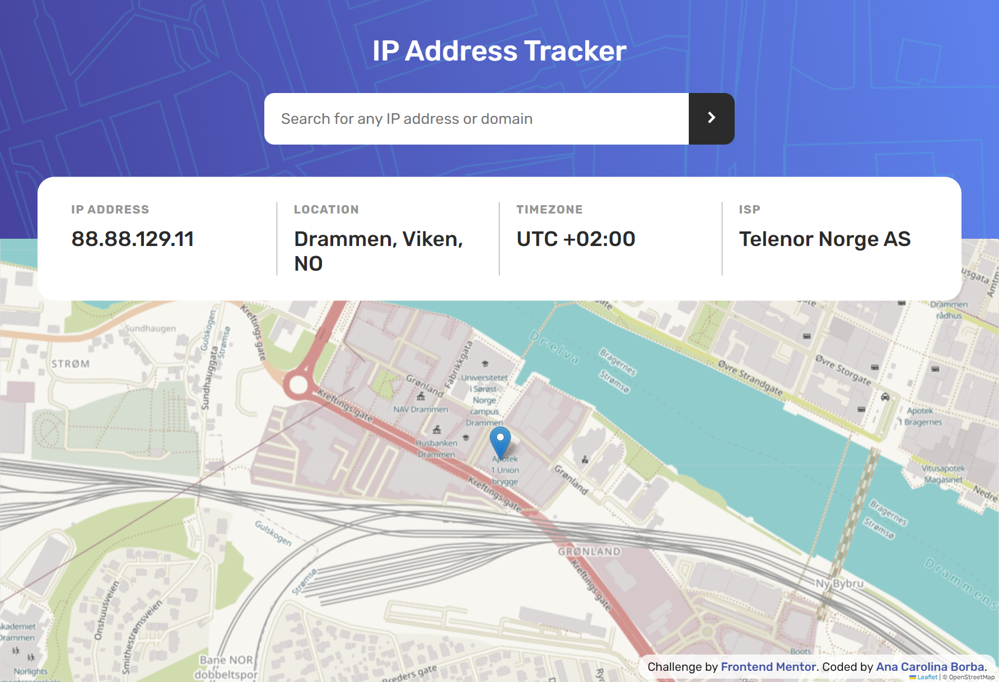
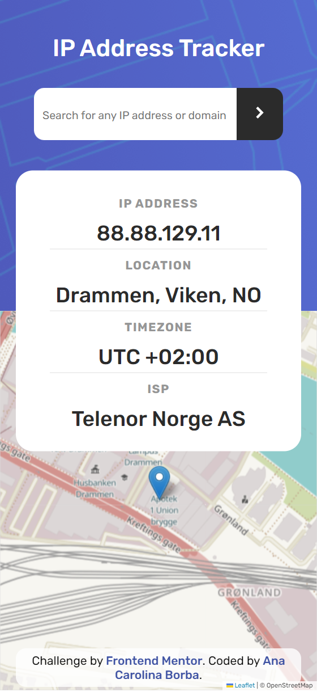

# Frontend Mentor - IP address tracker solution

This is a solution to the [IP address tracker challenge on Frontend Mentor](https://www.frontendmentor.io/challenges/ip-address-tracker-I8-0yYAH0). Frontend Mentor challenges help you improve your coding skills by building realistic projects.

## Table of contents

- [Overview](#overview)
  - [The challenge](#the-challenge)
  - [Screenshot](#screenshot)
  - [Links](#links)
- [My process](#my-process)
  - [Built with](#built-with)
  - [What I learned](#what-i-learned)
  - [Continued development](#continued-development)
- [Author](#author)

## Overview

### The challenge

Users should be able to:

- View the optimal layout for each page depending on their device's screen size
- See hover states for all interactive elements on the page
- See their own IP address on the map on the initial page load
- Search for any IP addresses or domains and see the key information and location

### Screenshot

()

### Links

- Live Site URL: [Netlify - IP Address Tracker](https://fm-iptracker.netlify.app/)

## My process

### Built with

- Semantic HTML5 markup
- CSS custom properties
- Flexbox
- Desktop-first workflow

### What I learned

I am currently learning asynchronous JS and this challenge was great practice with API integration using async/await functions.

### Continued development

-Asynchronous JS

- Async/await functions

## Author

- Frontend Mentor - [@anacarolinabmv](https://www.frontendmentor.io/profile/anacarolinabmv)
- LinkedIn - [Ana Carolina Borba](https://www.linkedin.com/in/ana-carolina-borba-88377632/)
